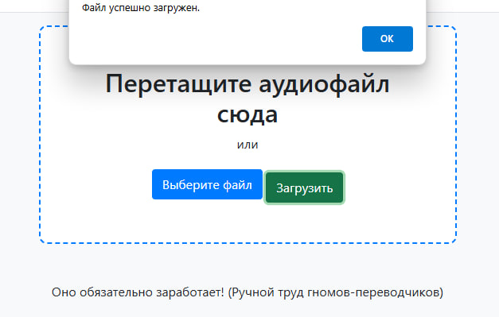
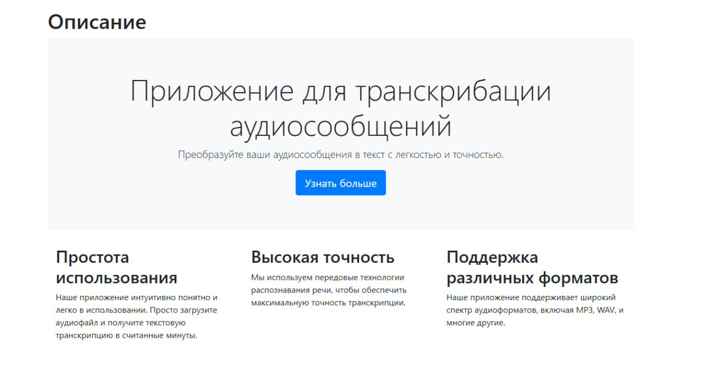

# Transcription Web Application

GreatTrancriber — это демо версия веб-приложения, разработанного на архитектуре MVC, предназначенного для работы с аудиофайлами. Оно позволяет пользователям загружать, хранить и отправлять аудиофайлы на транскрибацию с использованием стороннего сервиса.

## Основные возможности

- **Авторизация и регистрация пользователей**: Пользователи могут зарегистрироваться и войти в систему.
- **Загрузка аудиофайлов**: Пользователи могут загружать аудиофайлы для временного хранения и последующей транскрибации на сайте(wwwroot/uploads).
- **Хранение данных**: Аудиофайлы сохраняются в базе данных с привязкой к пользователю, который их загрузил.
- **Интеграция с внешним сервисом транскрибации**: Аудиофайлы отправляются на сторонний ресурс для транскрибации. В последнии текстовые файлы связываются с аудио.

## Используемые технологии

- **ASP.NET Core MVC**: Архитектура приложения.
- **Entity Framework Core**: ORM для работы с базой данных.
- **MSSQL Server**: База данных для хранения информации о пользователях и аудиофайлах.
- **Bootstrap**/**Font Awesome**: Дизайн и иконки для улучшения интерфейса.

## Настройка проекта

1. **Клонирование репозитория**:
   ```bash
   git clone https://github.com/Tr1xterX/GreatTrancriber.git
    ```
2. **Настройка строки подключения**:
*(предварительно [установив](https://www.microsoft.com/en-us/sql-server/sql-server-downloads) mssql сервер например)*

Откройте файл appsettings.json и настройте строку подключения к базе данных.

```c#
{
  "ConnectionStrings": {
    "DefaultConnection": "Server=localhost;Database=transcriptionapp;Trusted_Connection=True;"
  }
}
```
3. **Создание базы данных**:
Используйте Entity Framework Core для создания базы данных и применения миграций.
В консоли диспетчера пакетов выполните следующие команды(проект контекста бд Transcription.domain):
```
Add-Migration Initial
Update-Database
```
4. **Использование**
Регистрация и авторизация:
Зарегистрируйтесь или войдите в систему, используя предоставленные формы.


Загрузка аудиофайлов:

На главной странице выберите аудиофайл для загрузки. Файл временно сохраняется в папке uploads, а затем загружается в базу данных с привязкой к текущему пользователю.

Так же можете ознакомиться со страницей описания:

